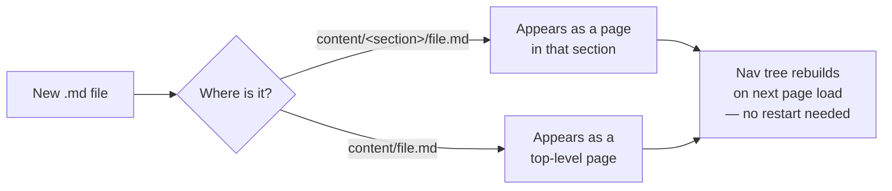

# Welcome to the PSPF EDMS Documentation Portal

This is the single reference point for the Public Service Pensions
Fund's Electronic Document & Records Management System (EDMS) —
covering **how to use it**, **how to test it**, and **how to build
against its API**.

## What's here

- **Knowledge Base** — step-by-step guides for every day-to-day task:
  registering a record, searching, routing for approval, rejecting,
  reporting, auditing, and archiving.
- **Architecture** — the solution architecture diagram and the
  reasoning behind it (encryption model, cloud storage abstraction,
  workflow engine).
- **Support** — technical support arrangements: who to contact, SLAs,
  escalation paths.
- **Sandbox** — a live, in-browser API console. Every request in the
  EDMS Postman collection is available here too, so you can test
  without installing anything. Sandbox access needs an approved
  developer account and an admin-issued API key — see
  [Getting Sandbox Access](/page/support/getting-sandbox-access).

## How this site works

Every page here is a plain Markdown file. Adding a new one — by an
admin, through the **Admin → Pages** panel, or by dropping a `.md`
file directly into the server's `content/` folder — makes it appear
in the navigation immediately, in the right section, with no rebuild
step. See [Authoring Pages](/page/support/authoring-pages) if
you're the one adding content.

