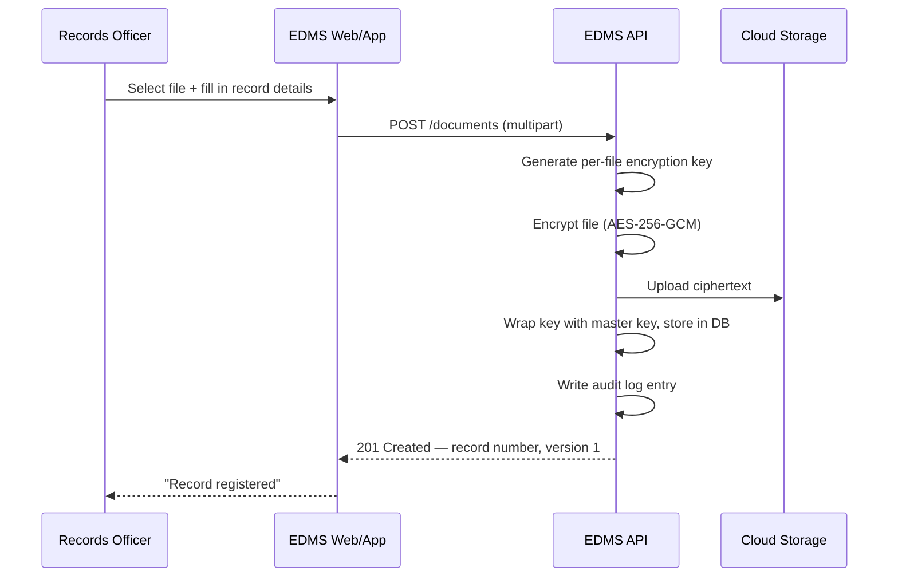

# Create and Save a Document

This covers registering a brand-new record — a pension claim, a
contribution statement, a payout voucher, or any other document type
configured in the system.

## Before you start

You'll need:
- **Write access** to the destination folder (Records Officer role or
  higher — see [Folder & Document Access](/page/knowledge-base/folder-and-document-access) if you get a permission error)
- The **source file** (PDF, image, or scanned document)
- The **record number** you intend to use, if your department assigns
  these manually (e.g. `PC-2026-0433`) — otherwise leave it to the
  system's convention

## Steps

1. Open **Repository** from the side navigation.
2. Choose the destination folder in the left rail (e.g. *Pension
   Claims / 2026 / Retirement*). If the folder doesn't exist yet, an
   Records Manager can create it first.
3. Click **Capture**.
4. Select the file to upload.
5. Fill in the record details:
   - **Record No.** — unique reference, e.g. `PC-2026-0433`
   - **Title** — a human-readable description, e.g. *"Application for
     Retirement Benefit — DLAMINI T.M."*
   - **Document Type** — e.g. *Claim — Retirement*
   - **Member Number / Name** — if the record relates to a scheme member
   - **Classification** — `public`, `internal`, `restricted`, or
     `confidential`. Confidential records require a stated reason
     every time they're opened later.
6. Click **Save**.

## What happens behind the scenes

The moment you click Save, the EDMS:

1. Generates a fresh, random encryption key for **this specific file**.
2. Encrypts the file with that key (AES-256-GCM) — *before* it ever
   leaves the server.
3. Uploads the encrypted bytes to whichever cloud storage provider is
   configured (AWS S3 / Azure Blob / Google Cloud Storage / local
   disk in a test environment).
4. Wraps the file's encryption key with the system's master key and
   stores *that* — never the plaintext file, never an unwrapped key —
   in the database.
5. Writes an audit trail entry: who, what, when, from which IP.

## Try it in the Sandbox

Sandbox → **Documents** folder → **Register Document (upload +
encrypt)**. You'll need an approved developer account and API key —
see [Getting Sandbox Access](/page/support/getting-sandbox-access).

## Related pages

- [Search and Retrieve a Document](/page/knowledge-base/search-and-retrieve-a-document)
- [Route a Document for Approval](/page/knowledge-base/route-a-document-for-approval)
- [Archive a Document](/page/knowledge-base/archive-a-document)
