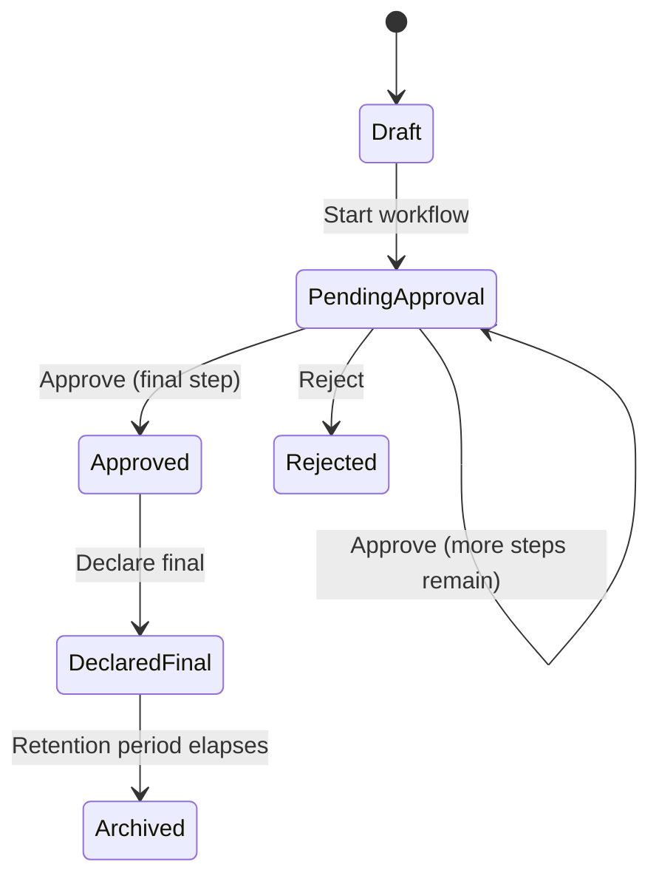

# Route a Document for Approval

Records that need sign-off (a retirement claim before payout, a
policy document before it's declared final) go through a **workflow**
— an ordered sequence of role-based approval steps, each with its own
SLA.

## Steps

1. Open the record in **Repository** or the **Document Viewer**.
2. Choose **Start Workflow** and select the workflow to apply (e.g.
   *Retirement Claim Assessment*). Workflows are pre-configured by an
   administrator in **Workflow Designer** — see
   [Configuring a Workflow](/page/knowledge-base/configuring-a-workflow).
3. The record's status changes to **Pending Approval**, and the first
   approver (matched by role) is notified.
4. Each approver in turn either **approves** (record moves to the next
   step, or to **Approved** if it was the last step) or **rejects**
   (see [Reject a Document](/page/knowledge-base/reject-a-document)).

## Checking where a record is

Open **Approvals** — anything currently waiting on *you* appears
there, along with the step name and its SLA. Records Managers and
System Administrators can see the full picture for any record via its
workflow instance.

## Try it in the Sandbox

Sandbox → **Workflow** folder → **Create Workflow**, then **Start
Workflow on Document**. Then **Approvals** folder → **My Approval
Inbox**.
