# Review Audit Logs

Every meaningful action in the EDMS — viewing a record, downloading
it, approving or rejecting it, changing a permission, logging in,
failing to log in, disposing of a record — is written to an
**append-only, hash-chained** audit log. Each entry's hash covers the
previous entry's hash, so deleting or editing a row breaks the chain
in a way that's detectable.

## Reading the log

1. Open **Audit Trail**.
2. Filter by **action type**, a **free-text search** (matches user
   name, record ID, detail, or IP address), or a **date range**.
3. Each row shows: timestamp, user, action, what it was done to, and
   from which IP address.

## Exporting

**Export CSV** downloads up to 50,000 of the most recent entries. This
download is itself logged (as a `Download` action against
`audit_log`) — auditing the audit log is intentional.

## Verifying the chain hasn't been tampered with

Click **Verify Hash Chain**. This walks every entry in order,
recomputing each one's hash from its content and the previous entry's
hash, and confirms it matches what's stored. If it finds a break, it
reports the first entry ID where the chain no longer lines up — that's
your starting point for investigating.

```mermaid
flowchart LR
    E1[Entry 1\nhash: H1] --> E2[Entry 2\nprev_hash: H1\nhash: H2]
    E2 --> E3[Entry 3\nprev_hash: H2\nhash: H3]
    E3 --> E4[Entry 4\nprev_hash: H3\nhash: H4]
    style E1 fill:#dceef4
    style E2 fill:#dceef4
    style E3 fill:#dceef4
    style E4 fill:#dceef4
```

## Who can access this

Audit Trail is normally limited to Internal Auditors, Records
Managers, and System Administrators.

## Try it in the Sandbox

Sandbox → **Audit** folder → **List Audit Entries**, **Export Audit
CSV**, **Verify Hash Chain**.
