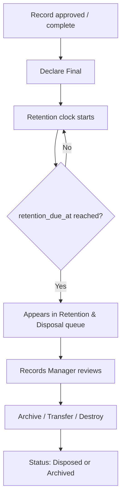

# Archive a Document

Archiving in the EDMS isn't a single button — it's the end of a
**retention lifecycle** that starts the moment a record is declared
final.

## Step 1 — Declare the record final

Once a record is complete (approved, or simply finished being worked
on), open it and choose **Declare Final**. This:

1. Sets its status to **Declared Final**.
2. Looks up the **retention class** assigned to the record (or its
   folder) — e.g. *"Pension claim records — 7 years"*.
3. Starts the retention clock: `retention_start_at = now`,
   `retention_due_at = now + retention period`.

You generally can't undo this from the record itself — retention
classes and their rules are managed by a Records Manager.

## Step 2 — Retention & Disposal review

Once `retention_due_at` has passed, the record appears in **Retention
& Disposal → Due for Review**. This list is deliberately *not*
automatic — every disposal action needs a **Records Manager** (or
System Administrator) to review and confirm it, per the retention
class's configured disposal action:

- **Archive** — move to long-term cold storage, kept but not
  actively worked with
- **Transfer to National Archives** — for permanent/historical records
- **Destroy** — securely deleted
- **Review** — flagged for manual reassessment before any of the above

## Step 3 — Disposal

A Records Manager opens the due record and confirms the disposal
action. The record's status becomes **Disposed** (or **Archived**,
depending on the action), and this is written to the audit trail like
everything else.

## Try it in the Sandbox

Sandbox → **Documents** folder → **Declare Record Final**, then
**Retention** folder → **List Records Due for Disposal** and
**Dispose Record**.
