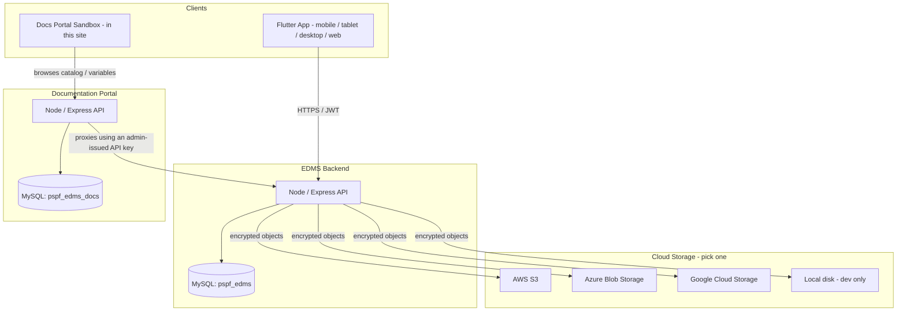

# Solution Architecture

## System context

Three independent, separately-deployable systems make up the overall
PSPF EDMS solution:

1. **EDMS API** (Node/Express + MySQL) — the system of record. Owns
   documents, folders, workflow, permissions, audit, retention.
2. **EDMS clients** — the Flutter app (mobile/tablet/desktop/web) and
   any other client (this portal's Sandbox, for instance) — talk to
   the EDMS API over HTTPS, never touch its database directly.
3. **Documentation Portal** (this site) — a standalone product with
   its own database, used for UAT, testing, and onboarding developers
   against the EDMS API. It calls the EDMS API the same way any other
   client would.

## Why the sandbox is a proxy, not a direct browser call

The Sandbox UI never calls the EDMS API directly from the browser.
Every "Send" goes to the Docs Portal's own backend first
(`POST /api/sandbox/execute`), which then makes the real call
server-side. Two reasons:

1. **No open proxy.** The destination is resolved from an
   admin-managed `sandbox_environments` row (by ID) — never from a
   URL the client supplies — so the sandbox can't be pointed at an
   arbitrary host.
2. **Usage accountability.** Every sandbox call is logged against the
   developer's account and API key (`sandbox_request_logs`), which is
   what lets an admin review sandbox activity per developer.

## Encryption model (EDMS side)

See [Create and Save a Document](/page/knowledge-base/create-and-save-a-document)
for the day-to-day view; in short: **envelope encryption**. Each
document version gets its own random AES-256-GCM key; that key is
wrapped by a master key that never leaves server-side configuration
(or a cloud KMS, in a hardened deployment); only the wrapped key is
stored in the database, alongside the encrypted file's location in
cloud storage.

## Authentication

- EDMS: username/password, Google, Microsoft, or (planned) Active
  Directory — plus mandatory MFA (TOTP, SMS, email, or backup codes)
  for roles that touch member money or personal data.
- Docs Portal: username/password only, with a separate concept of
  **API keys** for sandbox execution — a developer needs both a signed
  -in session (to browse the catalog) and a valid, admin-issued API
  key (to actually execute a call).

## API versioning

Every EDMS route is mounted under a version prefix (`/api/v1` by
default, set via `API_PREFIX` in the backend's `.env`). This is a
single config value in `server.js`, not scattered across route files
— shipping a breaking `/api/v2` later means mounting a second router
alongside the first, not rewriting anything. Every consumer (this
portal's Sandbox, the Flutter app, the Postman collection) points at
a full base URL including the version segment, and each moves to a
new version on its own schedule — nothing forces them to upgrade in
lockstep. See the EDMS backend's `DEPLOYMENT.md` (§6) for the details.

## Multiple sandbox environments — the deployment answer

The Sandbox never lets a developer type a URL to call. Every request
resolves its destination from an **environment** — a database row
(`sandbox_environments`) that only an admin can create or edit, under
**Admin → Environments**. Seeded out of the box: *Local (XAMPP)*,
*Local (Docker Compose)*, *Staging*, and *Production* (the last two as
placeholders until real URLs exist). Add as many as you need — a
colleague's local machine, a UAT environment, a disaster-recovery
region — each one just an admin-managed row, no code change and no
redeploy of this portal required to add or repoint one. This is also
what stops the Sandbox from being an open proxy: the destination host
always comes from this admin-controlled list, never from anything the
browser sends (see the earlier section on why the sandbox is a proxy,
not a direct browser call).
